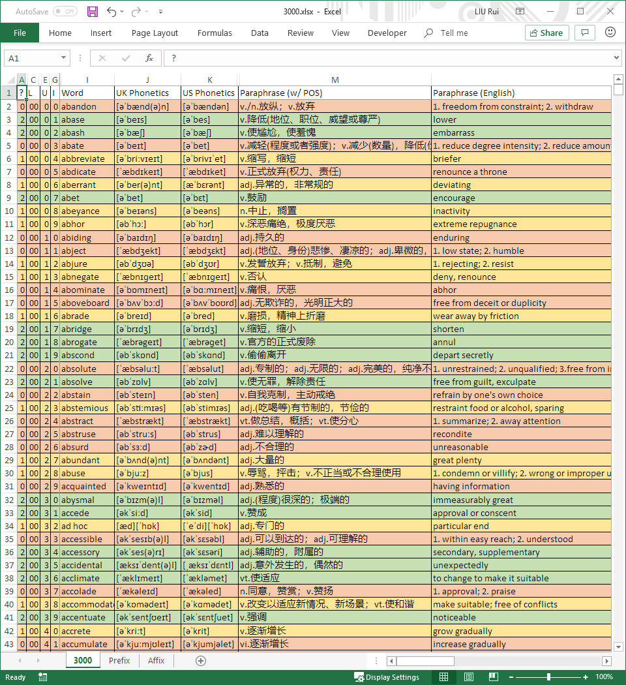

# 3000

Excel版再要你命3000

注意：实际的列宽比图片中大许多，该截图仅供展示用

## 基本信息

原始文件出处：<https://forum.chasedream.com/thread-702976-1-1.html>，作者“我和葡萄”

出版社：群言出版社

版次：2017年8月第2版第5次印刷

词汇数：3041

## 校验信息

|      文件名       |               MD5                |
| ----------------- | -------------------------------- |
| 3000.xlsx         | F936AA1781E69BE16791A0084A424581 |
| 3000(注释版).xlsx | B448D7A3F95F4E63B711C936FE3EB392 |
| 3000(宏版).xlsm   | 71C7BC49782B5A282B742EC473346229 |

此MD5值总是由master分支上最后一次commit的文件生成。

你可以从Microsoft Store上下载[MD5 Compare](https://www.microsoft.com/store/productId/9NDDMZLM8L0S)来执行检验。

如果你下载到的文件计算所得MD5值与此处不相同，可能是因为版本差异或者你使用了被第三方修改过的版本。

**风险提示：运行宏版前请务必确保文件来源的可靠性，若未通过MD5测试，请不要打开并立即删除宏版文件。**

## 对3000.xlsx的说明

### 全局

字体为Calibri(Body)，然而Calibri字体内并不包含中文，所以中文的显示字体可能因操作系统而异。

如果你已经开始使用（即'?'列被改变），但是希望与最近的版本保持同步，你可以先行将'?'列的值备份到其他文件（比如一个文本文档），之后下载最新版单词表，将备份的'?'列进行覆盖，即可恢复当前的学习进度。

### 列

A列'?'为熟记状态，有0,1,2三个可选的值，在条件格式下，0使得整行为浅红底色，1为黄，2为绿。但若某单元格为空，则不受此限制，必然为无底色。

B列'L2'（隐藏）为List序号，从01开始，到31结束，是正常的计数方式。

C列'L'为List编号，从00开始，到30结束，符合编程的思维，也方便计数。

D列'U2'（隐藏）为Unit编号，从01开始，到10结束，是正常的计数方式。

E列'U'为Unit编号，从0开始，到9结束，符合编程的思维，也可以少显示一位数字。

F列'I'（隐藏）为Item编号，从01开始，到10结束，是正常的计数方式。

G列'I2'为Item编号，从0开始，到9结束，符合编程的思维，也可以少显示一位数字。

H列'R'（隐藏）为一组随机数，配合`Home`->`Editing`->`Sort & Filter`->`Custom Sort...`可以乱序背诵。

I列'Word'为单词。

J列'UK Phonetics'为英式音标，来自[音标网](http://www.yinbiao5.com/18.html)，是推荐使用的读音参照。

K列'US Phonetics'为美式音标，来自[音标网](http://www.yinbiao5.com/18.html)，但是并不推荐使用，因为很多音标与词典出入较大。

L列'Paraphrase'（隐藏）为中文释义，多个释义之间用分号分隔，释义中原有的分号不做处理。为了减小列宽，所有括号都替换为了英文括号；省略号不是三个点号。

M列'Paraphrase (w/ POS)'为中文释义，与L列类似，但明确给出了释义的词性。

N列'Paraphrase (English)'为英文释义，多个释义之间用分号分隔。

## 对3000(注释版).xlsx的说明

该版本在3000.xlsx的基础上进行了改进。

将I列'Word'进行了加粗处理。

将L列'Paraphrase'的内容隐藏到批注(comment)中，仅当指针移动到单元格时才会显示释义，避免提前看到下一个单词的释义。

## 对3000(宏版).xlsm的说明

**注意：该文件没有随3000.xlsx更新。**

该版本在3000(注释版).xlsx的基础上进行了改进。

以10个单词为一组(unit)，通过点击K1单元格的“上一组”和“下一组”切换不同的组。

通过在N1单元格输入序号，并点击O1单元格的“跳转”按钮，可以切换到该序号的单词所在的组。

由于编号起始值均从0开始，因而“跳转”实际会跳转到其前一个序号的单词。
如输入320，则会跳转到List（C列）为03，Unit（E列）为1，Item（G列）为9的单词，该单词为cavil。

## 反馈

### 联系我

我的邮箱可以在Profile里找到，各种错误、排版瑕疵、建议等都可以通过这个邮箱联系我。

### Pull Request

如果你想要提交一份Pull Request，请直接提交'?'列为全0的xlsx文件。

## 许可证

本项目暂时没有选择合适的许可证，可能会在后续的版本中进行更新。

就目前而言，如果是个人使用，可以自由下载而不需额外的操作；但如果要转载，请在合适的位置标明本项目的作者信息和原始链接<https://github.com/liurui39660/3000>，当然你也可以向我发邮件，与我分享这个令人愉悦的消息。

## 贡献者

**贡献者按照时间先后顺序进行排列。**

[cameron93lin](https://github.com/cameron93lin)贡献了注释版和宏版。

[hongfalu](https://github.com/hongfalu)发现了原版中的顺序错误，并校正了原版和注释版中单词和释义的顺序。
